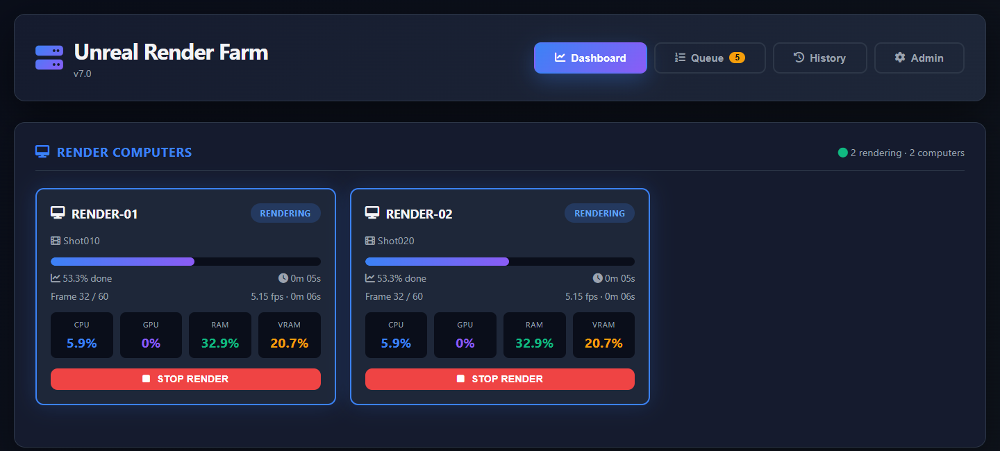
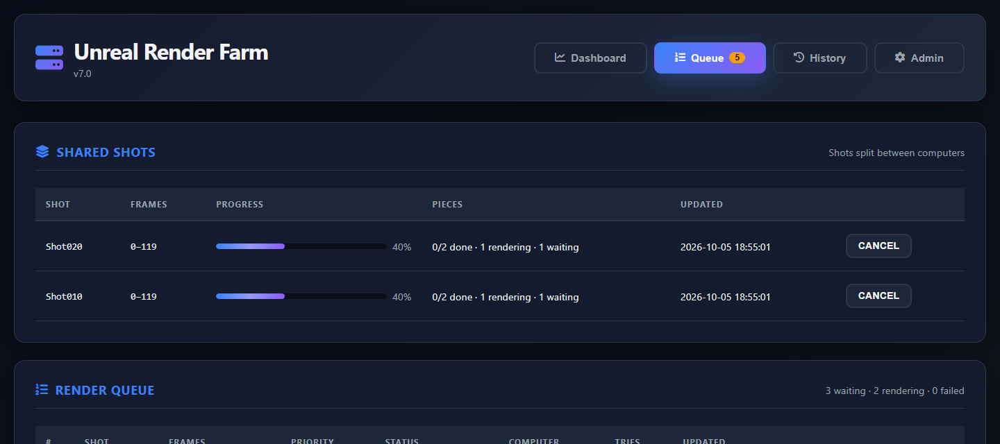
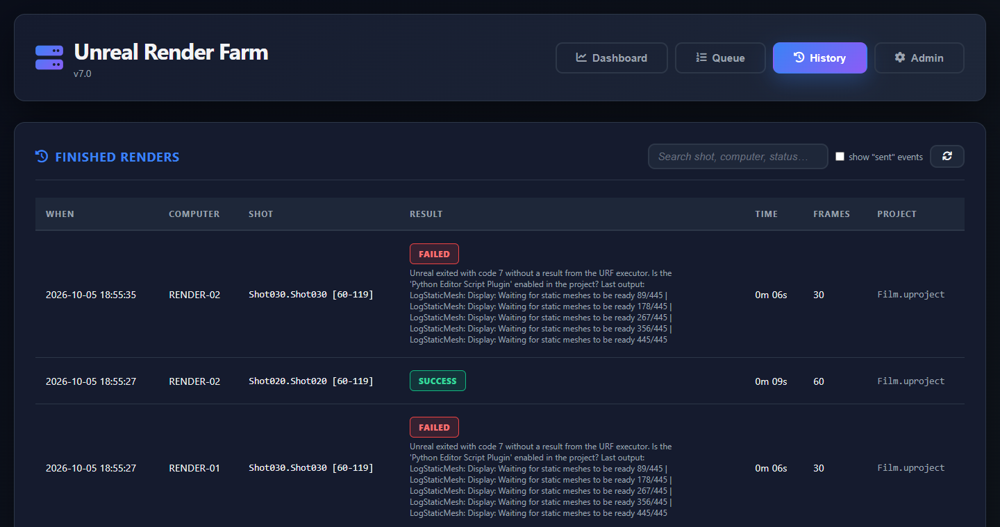
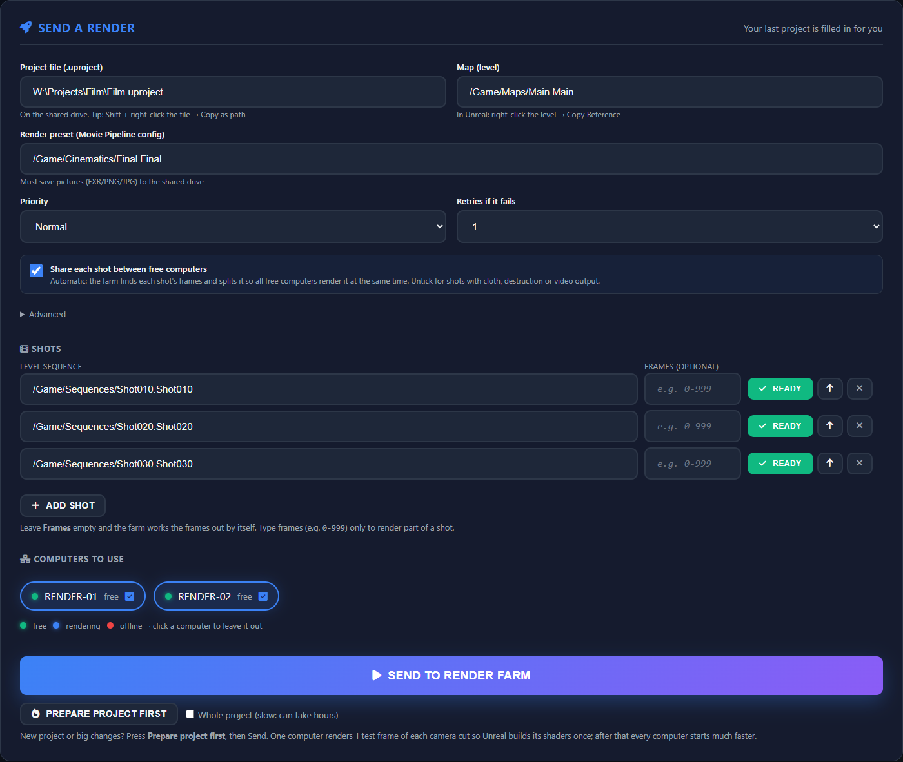
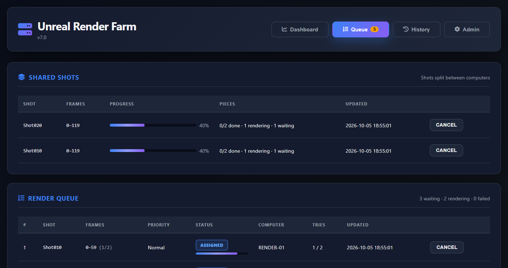

# Unreal Render Farm

**Distributed Movie Render Queue rendering for Unreal Engine 5, run from a web dashboard.**

**[Website and quick start](https://f1hunterr.github.io/unreal-render-farm/)** ·
**[User guide for artists](docs/USER_GUIDE.md)** ·
**[Download a release](https://github.com/f1hunterr/unreal-render-farm/releases)** ·
**[Changelog](CHANGELOG.md)**




You queue level sequences from one dashboard, and every idle render node picks up the next one,
renders it with Unreal's Movie Render Queue, and reports back. Long shots are split across several
computers automatically. Failed shots are retried, and everything is recorded in a render history.
It is free and open source (MIT), and runs entirely on your own network.

> **Status: early but working.** Used on a small Windows farm with Unreal Engine 5.6 since
> October 2026: shots split across computers come out complete (no missing or doubled frames), and
> renders report progress, check their frames and close Unreal by themselves. Expect rough edges.
> The farm logic is covered by 160+ automated tests, including a simulated Unreal Python API.
> Bug reports and pull requests are welcome.

---

## Features

- **Shots shared between computers automatically.** Tick one box: the farm reads each shot's
  frame range from Unreal, cuts it into one piece per available computer, and they all render
  their piece at the same time into the same image sequence. Deadline does this for Blender and
  Maya, but not for Unreal out of the box. Piece boundaries move onto nearby **camera cuts**, which
  Epic calls the smallest unit of work that splits cleanly.
- **Frames always on the shared drive.** Set a farm output folder once on the Admin tab (e.g.
  `K:\Renders`): every render saves to `<folder>\<project>\<shot>` on every computer, whatever folder its
  preset names. A render can override it (**Advanced → Save frames to**, or in **Edit**). Without one,
  a preset that saves to a computer's local drive (e.g. `E:`) is sent next to the project instead.
- **Video on split shots.** A shot split between computers keeps its image outputs and skips the
  preset's video output (MP4, ProRes, DNx): make the video from the frames. A video-only preset renders
  the shot whole on one computer.
- **Out-of-memory crashes don't repeat.** When Unreal runs out of memory, the retry goes to another
  computer; with no other computer allowed, the job stops and says what to change.
- **Artists' PCs help when idle (workstation mode).** Set an artist's PC up with
  `SETUP-WORKSTATION.bat`: it takes farm work only after 15 minutes without keyboard or mouse (60 when
  its owner's Unreal Editor is open), optionally only in hours like `20:00-08:00`, and stops within
  seconds when its owner comes back. The piece goes to another computer without using a try.
- **Shared cache, set once.** Type a NAS folder on the Admin tab. Every render computer then uses
  it as Unreal's shared Derived Data Cache, so shaders and textures are built once, not once per
  computer. **Test on all computers** checks that each one can write there.
- **Prepare project.** One click renders one test frame per camera cut into a throw-away folder,
  which builds and caches everything the real render needs. **Whole project** runs Epic's
  `-run=DerivedDataCache -fill` instead.
- **Frame check.** After every piece, each written frame is checked on the drive. Missing or 0-byte
  frames fail the piece, so it renders again.
- **Frozen-render watchdog.** Unreal is stopped and the task retried when it prints nothing for 30
  minutes while loading (2 hours for a whole-project prepare), or when its engine stops ticking for 20
  minutes while rendering. The executor sends a heartbeat every 30 s, so one very slow frame is never
  mistaken for a freeze. Unreal and everything it starts run in a Windows job object, so stopping it
  also stops its ShaderCompileWorkers.
- **Plans checked across computers.** If a computer plans different frames for its piece than the
  shot's plan (an older agent, or an out-of-date copy of the sequence), that piece is stopped and
  rendered again with the shot's frames.
- **nDisplay skipped.** Farm renders force Unreal's plain game engine, so a project with the nDisplay
  plugin enabled doesn't load `DisplayClusterGameEngine`.
- **Job queue with priorities.** Each sequence, or each chunk of a split shot, is one job. Jobs
  are Rush, Normal or Low, and you choose which nodes may render a batch.
- **Automatic retry.** A failed sequence retries 0–3 times. When another node is idle, the retry
  goes there instead of the node that just failed.
- **Self-healing.** A job is handed back to the queue if its node restarts mid-render or is
  unreachable for 10 minutes.
- **Live progress.** The dashboard shows the current frame, percentage, FPS and ETA, plus CPU,
  GPU, RAM and VRAM per node (GPU stats need NVIDIA).
- **Accurate results.** A render counts as `SUCCESS` only when the farm's executor inside Unreal
  reports that Movie Render Queue succeeded. That's more reliable than Unreal's exit code, which
  can be 0 after a failed render. Otherwise the render is recorded as `FAILED`, with the reason
  and the last lines of Unreal's output. The executor also counts the files written and flags a
  task that wrote the wrong number of frames.
- **Full render logs.** Every render's complete Unreal output is saved on the node.
- **Secured.** The dashboard needs a login and agents need a shared farm token. Agent inputs are
  validated, the dashboard runs under a strict Content-Security-Policy, and cancelling kills only
  the farm's own Unreal process.
- **Easy to run permanently.** The master runs in Docker or as a Windows service, agents run as
  Windows services, and both restart themselves if they stop.

| Queue | History |
|---|---|
|  |  |

*Screenshots are from a demo run with a simulated Unreal. Shot030 was set up to fail, so the
history shows its retry.*

---

## How it works

```
   Browser ──login──▶  MASTER  (farm_master.py, port 5000)
                       │  dashboard · job queue · scheduler · history (SQLite)
                       │
                       │  every 2 s: status + finished results     (X-Farm-Token)
                       │  idle node → next job (POST /render)
          ┌────────────┼────────────┐
          ▼            ▼            ▼
       AGENT        AGENT        AGENT     (farm_agent.py, port 5001, on each Windows node)
     UnrealEditor-Cmd.exe <project> <map> -game -LevelSequence=<seq>
                        -MoviePipelineConfig=<config> -unattended -stdout -FullStdOutLogOutput
```

- The **master** holds the node registry, the queue and the history. A background loop polls
  every node every 2 seconds, collects finished results, and hands the highest-priority queued job
  to each idle node. This happens whether or not anyone has the dashboard open.
- An **agent** runs one sequence at a time. It streams Unreal's output to read progress, saves
  the full log, and records the result (exit code, frames, duration) for the master to collect.
  Results are numbered, so nothing is logged twice, even after a restart.

---

## Requirements

**Render nodes:** Windows 10/11, Unreal Engine 5.6, Python 3.9+. An NVIDIA GPU is needed for GPU
and VRAM stats. Projects must be on a path the node can read (local or a mapped/UNC share).

**Master:** either Docker (Docker Desktop on Windows works) or Windows with Python 3.9+. It's
light: 2 cores and 4 GB RAM is plenty.

**Network:** the master must reach each agent on TCP 5001, and users must reach the master on
TCP 5000. Keep both inside your local network.

---

## Setup

### 1. Create the settings file

Both programs read `farm.env` in this folder. Copy the template and fill it in:

```powershell
copy farm.env.example farm.env
```

| Setting | Where | What |
|---|---|---|
| `URF_FARM_TOKEN` | master **and** every node | Shared secret, 16+ characters, **the same everywhere** |
| `URF_DASH_PASSWORD` | master | Dashboard password, 16+ characters (user name `admin`) |
| `URF_PROJECT_ROOTS` | nodes | Folders projects must be under, e.g. `D:\Projects;N:\Projects` |

Neither program starts without its secrets. `farm.env` is in `.gitignore`, so never commit
it. To generate a secret: `python -c "import secrets; print(secrets.token_urlsafe(32))"`.

### 2. Start the master

**Option A: Docker (recommended)**

```powershell
docker compose up -d --build        # dashboard on http://<this-machine>:5000
docker compose logs -f master       # follow the logs
```

The database and node registry live in the `farm-data` volume, so they survive rebuilds.
The container restarts automatically and Docker checks its health through `/healthz`. Set
`URF_PUBLISH_PORT` to publish on another host port, or `URF_TZ` to change the timezone used
for history timestamps (default UTC; e.g. `URF_TZ=IST-5:30`). Put these in a `.env` file next to
`docker-compose.yml`. To keep using an existing Docker volume for the database, set `URF_DATA_VOLUME`.

> **Docker Desktop on Windows:** other PCs can reach the dashboard only if Windows Firewall
> allows `com.docker.backend.exe` on TCP 5000. If you dismissed Windows' firewall prompt when
> Docker was installed, it created a *Block* rule. Narrow or remove that rule, then allow TCP
> 5000 from the local subnet. Docker Desktop also starts only when a user logs in.

**Option B: Windows service**

From an elevated PowerShell in this folder:

```powershell
pip install -r requirements.txt
.\deploy\install_service.ps1 -Role Master -AllowFrom 192.168.1.0/24
```

This runs the master at boot as SYSTEM and restarts it 10 seconds after it stops. It also
restricts `farm.env` to Administrators, SYSTEM and the service user, and opens TCP 5000 only
to `-AllowFrom`.

Don't run both options on the same machine, because they would compete for port 5000.

### 3. Set up render nodes (copy and double-click)

**Build the node package once, on the master:**

```powershell
.\deploy\build_agent_package.ps1          # or: -MasterUrl http://<master-ip>:5000
```

This creates `dist\UnrealRenderFarm_agent` (and a `.zip` of it, about 27 MB) containing:
- the agent and its setup scripts;
- the Python 3.12 installer, with its signature checked;
- every dependency as an offline wheel;
- a `farm.env` with this farm's token and the master's address.

The build needs internet and a Python with pip (`-Python <path>`). Rebuild the package after
changing the farm token or the master address.

**On each render node:**

1. Copy `UnrealRenderFarm_agent` (or the zip, extracted) to the machine.
2. Double-click **`SETUP.bat`** and click **Yes** when Windows asks for admin rights.

Setup then:
- installs to `C:\UnrealRenderFarm\node`;
- installs Python 3.12 if the machine doesn't have it (no internet needed);
- finds Unreal Engine 5 through the Epic launcher, the registry or Program Files;
- installs the agent as an auto-starting, self-restarting task, with port 5001 open to the master
  only;
- registers the machine with the master.

The node appears in the dashboard by itself. To update a node, copy a newer package and run
`SETUP.bat` again; settings changed on the node are kept. To remove it, run `UNINSTALL.bat`.
The setup log is in `C:\UnrealRenderFarm\logs\setup.log`.

The agent starts when the user who ran setup logs on. Unreal needs an interactive desktop session
to use the GPU, so set that user to log on automatically (for example with Sysinternals
Autologon). Nodes re-register every minute, so a changed IP address is picked up by itself.

*Manual alternative:* copy this folder, set `URF_FARM_TOKEN` (and optionally `URF_MASTER_URL`) in
`farm.env`, then run `pip install -r requirements.txt` and
`.\deploy\install_service.ps1 -Role Agent -AllowFrom <master-ip>` from an elevated PowerShell.
To try an agent without installing it, run `python agent\farm_agent.py`.

### 4. Render

1. Open `http://<master-ip>:5000` and log in. Registered nodes appear under **Render Computers**
   and should show `FREE`. Nodes without `URF_MASTER_URL` can be added by hand on the **Admin**
   tab.
2. Under **Send a Render**, fill in the labelled boxes (pasting is fine: quotes from *Copy as path*
   and Unreal's *Copy Reference* text are cleaned up). The browser remembers them for next time.
   - **Project file:** the `.uproject` path *as the nodes see it*, e.g. `D:\Projects\Film\Film.uproject`.
   - **Map:** e.g. `/Game/Maps/Main.Main`.
   - **Render preset:** the Movie Pipeline config asset, e.g. `/Game/Cinematics/Final.Final`.
3. Choose a priority and a number of retries, then add shots (e.g. `/Game/Sequences/Shot010.Shot010`).
   New shots are **Ready**; click Ready to **Skip** one.
4. Under **Computers to use**, the dot shows each computer's state (green free, blue rendering,
   red offline) and the tick shows whether this batch may use it. Click **Send to Render Farm**.



---

## Splitting a shot across machines



**Automatic (default).** Keep **Share each shot between free computers** ticked and leave the
**Frames** box empty. That's all:

1. The master cuts the shot into one piece per computer that may render it and is online with a
   current agent, and **all of them start at once**, each told "you are piece i of N".
2. Each computer opens Unreal and reads the shot's frame range from the Level Sequence, or from
   the preset when its *Use Custom Playback Range* is on. Every computer makes the same plan and
   renders its own piece. No computer waits for another.
3. A piece is never shorter than `URF_AUTO_MIN_CHUNK` frames (default 50), because each piece
   pays Unreal's start-up time. If a short shot needs fewer pieces, the extra ones finish at once
   with "Nothing to render".
4. The first piece to report the plan writes every piece's frames into the queue, so a retried
   piece renders exactly the same frames on any computer.
5. A preset that writes video (MP4, ProRes, DNxHR, command-line encoder) and pictures: each piece keeps
   the pictures and skips the video (make the video from the frames). A video-only preset renders the
   shot whole on one computer.
6. Every computer of a shot uses the same start time, so `{date}`/`{time}` in file names match.

While Unreal loads, each computer's card shows what it is doing ("Building meshes 54/445",
"Compiling shaders", "Loading the map") with a timer. The first render of a project on a computer
can take 10+ minutes. Set the **Shared Cache Folder** on the Admin tab so that work is done once
for all computers. Press **Prepare project first** before the first render of a new project.

**Camera cuts.** Each computer reads the sequence's shot and camera-cut sections. A piece boundary
moves to a cut when one is within a quarter of a piece. Every computer makes the same plan, so the
pieces still line up. Boundaries with no cut nearby stay where they are, and warm-up frames cover them.

**Manual (Advanced).** Type a range in **Frames** (e.g. `0-999`) to render only part of a shot.
With sharing ticked, the farm picks the piece size from the free computers. Set **Advanced →
Frames per task** to choose it yourself. **Warm-up frames** (default 8) renders throwaway frames
before each piece, so temporal effects (TAA, Lumen, motion blur) match across piece boundaries.

The **Queue** tab shows each shared shot under **Shared Shots**, with one bar for the whole shot
that counts the live progress of rendering pieces. **Retry failed** re-runs only the pieces that
failed. Untick sharing for shots with cloth, destruction or long simulations, which may not
match across pieces.

Requirements and limits:
- **An image-sequence output** (EXR/PNG/JPG/BMP) in the Movie Pipeline config, with
  `{frame_number}` in the file name format (the default includes it). Video outputs are skipped on
  split pieces (see above).
- The frames must go to a folder **all computers write to**. Set the farm output folder on the Admin
  tab, or the farm moves a preset folder on a local drive next to the (shared) project.
- The project needs the **Python Editor Script Plugin** enabled. It's included with Unreal: enable
  it under *Edit → Plugins*.
- Shots with simulations that build up over time (Chaos cloth, destruction, long particle
  effects) may not match across chunk boundaries. Render those whole: leave **Frames per task**
  at 0.

How it works: the agent starts Unreal with the farm's Movie Render Queue executor
(`agent/unreal/urf_executor.py`, loaded through `UE_PYTHONPATH`, so your project isn't modified).
The executor loads your config preset and turns on *Use Custom Playback Range* for the task's
frames. It then reports progress and the number of files written back to the agent.

### First render checklist

Do this once on a new farm (or a new Unreal version):

1. Render one sequence **whole** (Frames per task `0`, no frame range). If it fails with
   *"without a result from the URF executor"*, the Python plugin isn't enabled, or the executor
   didn't load: check the node's render log in `C:\UnrealRenderFarm\agent\logs`.
2. Render a **range**, e.g. `0-49`, on one node. Check that exactly 50 frames were written, from 0
   to 49. (Verified on UE 5.6. If another version writes 49 or 51, change `MRQ_END_EXCLUSIVE` in
   `agent/unreal/urf_mrq_common.py`; the history also reports a frame-count mismatch.)
3. Split a shot over two nodes and step through the frames around a chunk boundary for visible
   seams.

If the executor can't work in your setup, set `URF_UE_MODE=legacy` on the nodes to render whole
sequences the old way.

---

## Using the dashboard

| Tab | What it shows |
|---|---|
| **Dashboard** | **Render Computers**: each computer's live state, progress and resource use, a **Stop Render** button, and a compact card saying since when for offline ones. **Send a Render**: the job form |
| **Queue** | **Shared Shots** (one bar per split shot, Cancel, Retry failed), then every job with its frames, status (with a live bar while rendering), computer and tries; **Cancel** (asks first) and **Retry** buttons. Failed rows have **Retry** (same settings, straight away) and **Edit**, which opens a window showing why it stopped and the settings it used (project, map, preset, shot, frames, sharing, priority, retries, computers) so you can fix them, tick more computers (or add a new one by name and IP) and retry; for a shared shot the changes apply to every failed piece |
| **History** | Finished renders, newest first, with duration, frame count and the reason under any failure. Search by shot, computer or status; tick *show "sent" events* to include dispatches |
| **Admin** | Registered computers (with Remove), adding a computer by hand, and the node setup steps |

Messages appear as small notices in the bottom-right corner, and anything destructive asks for
confirmation in the page. The layout works on a phone.

**Queue statuses:** `QUEUED` (waiting for a node) → `ASSIGNED` (rendering) → `SUCCESS`, `FAILED`
(no retries left) or `CANCELLED`.

**Node states:**

| State | Meaning |
|---|---|
| `FREE` | Ready for work (the agent reports `IDLE`) |
| `INITIALIZING` / `RENDERING` | Working on a job |
| `CANCELLING` | Stopping a job |
| `OFFLINE` | Agent not reachable |
| `AUTH ERROR` | The node's farm token doesn't match the master's |
| `CONNECTING` | Not polled yet |

**History statuses:**

| Status | Meaning |
|---|---|
| `DISPATCHED` | Job sent to the node |
| `SUCCESS` | The farm's executor inside Unreal reported that Movie Render Queue succeeded and wrote its frames |
| `FAILED` | Unreal exited with an error code, or couldn't start |
| `CANCELLED` | Stopped by a user |
| `REJECTED` | The node refused the job, e.g. the project file isn't on that node. This counts as a failed attempt |

---

## Configuration reference

Settings come from environment variables or `farm.env`. Environment variables win.

### Master (`master/farm_master.py`)

| Variable | Default | Notes |
|---|---|---|
| `URF_FARM_TOKEN` | *(required)* | Shared secret sent to agents |
| `URF_DASH_PASSWORD` | *(required)* | Dashboard login (HTTP Basic) |
| `URF_DASH_USER` | `admin` | Dashboard user name |
| `URF_MASTER_DIR` | `C:\UnrealRenderFarm\master` | Holds `render_farm.db` and `nodes.json` (`/data` in Docker) |
| `URF_MASTER_BIND` / `URF_MASTER_PORT` | `0.0.0.0` / `5000` | Listen address |
| `URF_AGENT_PORT` | `5001` | Port the agents listen on |
| `URF_LOG_FILE` | *(unset)* | Rotating log file (10 MB × 5) |
| `URF_CONFIG` | `farm.env` next to this README | Settings file location |

### Agent (`agent/farm_agent.py`)

| Variable | Default | Notes |
|---|---|---|
| `URF_FARM_TOKEN` | *(required)* | Must match the master |
| `URF_MASTER_URL` | *(unset)* | e.g. `http://192.168.1.5:5000`. When set, the node registers itself with the master at start and every minute |
| `URF_PROJECT_ROOTS` | *(unset)* | `;`-separated folders that `.uproject` files must be under. If unset, any existing local path is accepted. UNC paths (`\\server\share`) require this to be set |
| `URF_UE_EXE` | `C:\Program Files\Epic Games\UE_5.6\Engine\Binaries\Win64\UnrealEditor-Cmd.exe` | Unreal command-line binary |
| `URF_UE_MODE` | `executor` | `executor` renders through the farm's Movie Render Queue executor (frame ranges, exact progress). `legacy` is a plain whole-sequence render without Python, as a fallback |
| `URF_AGENT_BIND` / `URF_AGENT_PORT` | `0.0.0.0` / `5001` | Listen address |
| `URF_SHARED_DDC` | *(unset)* | Fallback shared Derived Data Cache folder (passed to Unreal as `UE-SharedDataCachePath`). The **Admin → Shared Cache Folder** setting on the master wins when set |
| `URF_NIMBY` | *(off)* | `1` = workstation mode (set by `SETUP-WORKSTATION.bat`): render only while nobody uses this PC |
| `URF_NIMBY_IDLE_MIN` / `URF_NIMBY_EDITOR_IDLE_MIN` | `15` / `60` | Minutes without keyboard or mouse before it takes work (the second when its owner's Unreal Editor is open) |
| `URF_NIMBY_HOURS` | *(any time)* | Only render in this window, e.g. `20:00-08:00` |
| `URF_NIMBY_ON_RETURN` | `stop` | `stop`: give the PC back within seconds (the piece is rendered elsewhere). `finish`: finish the current piece first |
| `URF_SKIP_NDISPLAY` | `1` | Adds `-ini:Engine:[/Script/Engine.Engine]:GameEngine=/Script/Engine.GameEngine` so nDisplay's engine doesn't load. Set `0` for projects that really render through nDisplay |
| `URF_LOAD_STALL_MIN` / `URF_RENDER_STALL_MIN` / `URF_FILL_STALL_MIN` | `30` / `20` / `120` | Frozen-render watchdog: stop Unreal after this many minutes with no output while loading, with no heartbeat from the engine while rendering, or with no output during a whole-project prepare. `0` turns one off |
| `URF_AGENT_LOG_DIR` | `C:\UnrealRenderFarm\agent\logs` | Full Unreal output per render (newest 200 kept) |
| `URF_LOG_FILE` | *(unset)* | Rotating log file (10 MB × 5) |

---

## Security

- **Logins:** the dashboard requires a login, and agents accept requests only with the farm
  token. The exception is each program's health check (`/health` on agents, `/healthz` on the
  master), which reveals nothing. Both programs refuse to start without their secrets.
- **Validated inputs:** agents accept only a `.uproject` path (inside `URF_PROJECT_ROOTS` when
  set) and Unreal asset paths (`/Game/...`). Nothing a user types can become an extra Unreal
  command-line switch.
- **Node registry:** in the dashboard, a registered node's IP can't be silently changed; remove the
  node first. Self-registration needs the farm token and may move a node to a new IP only while
  its old IP is offline. Node IPs must be private LAN addresses.
- **Dashboard:** all displayed data is escaped. The page runs under a strict
  Content-Security-Policy (no inline or injected scripts), and Font Awesome is pinned with a
  Subresource Integrity hash. Cross-site requests are refused.
- **Cancel:** stops only the Unreal process the agent started, never other Unreal instances on
  the machine.
- **Network:** traffic is plain HTTP. Keep the farm on a trusted network and limit ports
  5000/5001 to the farm subnet (`install_service.ps1 -AllowFrom` does this).

---

## Operations

**Logs**

| Component | Where |
|---|---|
| Docker master | `docker compose logs -f master` |
| Windows service | `C:\UnrealRenderFarm\logs`: `*.console.log` is the current run, `*.crash.log` holds errors, `*.restarts.log` holds the restart history |
| Either | Set `URF_LOG_FILE` for a rotating log file |

**Backups:** everything the master knows is in `render_farm.db` and `nodes.json`, in the
`farm-data` volume or in `URF_MASTER_DIR`.

**Updating:** pull the new code, then run `docker compose up -d --build` (Docker), or re-run
`install_service.ps1` (Windows; it stops the old copy first). Running jobs are recovered: if
results are lost during a restart, those jobs are re-queued.

**Uninstalling a service:** run `.\deploy\uninstall_service.ps1 -Role Agent` (or `-Role Master`).

### Render logs and the progress parser

The agent reads progress from Unreal's output lines, for example `Rendering Frame 45/120`. If a
render succeeds but no progress line was recognized, its history entry says so. To see what the
parser understood in a real log:

```powershell
cd C:\UnrealRenderFarm\node
.venv\Scripts\python.exe tools\check_ue_log.py C:\UnrealRenderFarm\agent\logs\<render>.log
```

To make a real log a permanent regression test, copy it into `tests/fixtures/ue_logs/` with a
matching `.json`. See [the fixtures README](tests/fixtures/ue_logs/README.md).

---

## Troubleshooting

| Symptom | Check |
|---|---|
| Node shows `OFFLINE` | Is the agent running on the node? Can the master reach `<node-ip>:5001`? Firewall on the node, and the IP registered in the dashboard |
| Node shows `AUTH ERROR` | `URF_FARM_TOKEN` differs between the master and that node |
| Job `REJECTED` / *project file not found on this node* | The project path must exist **on the node**, inside `URF_PROJECT_ROOTS` |
| Job `FAILED` with an exit code | Hover the status for the last lines of Unreal's output; the full log is in the node's `URF_AGENT_LOG_DIR` |
| Rendering, but progress stays at 0% | The parser doesn't recognize this Unreal version's output. Run `tools\check_ue_log.py` on the render log |
| Dashboard works only on the master PC | Firewall on the master (see the Docker note under [Setup](#2-start-the-master)) |
| Service keeps restarting | Read `C:\UnrealRenderFarm\logs\*.crash.log`. A missing secret or an occupied port are the usual causes |
| GPU/VRAM shows `n/a` | No NVIDIA GPU or driver found on the node |
| Shared cache test says *Access is denied* | The Windows user the agent runs as (shown in the message) can't write to that NAS folder. Give it write access, or save its NAS login in Windows Credential Manager for that user |
| *frame file(s) missing or empty on the drive* | The output share dropped or is full. The piece renders again by itself; check free space on the NAS |
| *Unreal froze …* | Unreal's engine stopped and it was closed. Known causes: Niagara Audio Spectrum, GPU particles with EXR/PNG output. Slow frames alone don't trigger it |

---

## Development

```powershell
pip install -r requirements.txt
python -m unittest discover -s tests      # no Unreal needed (a fake Unreal API stands in)
powershell -ExecutionPolicy Bypass -File tests\test_deploy.ps1   # setup-script checks (as admin)
```

```
unreal-render-farm/
├── master/
│   ├── farm_master.py      # Dashboard server, job queue & scheduler
│   └── static/                # Dashboard page (index.html, dashboard.js, dashboard.css)
├── agent/
│   └── farm_agent.py     # Render node agent
├── deploy/                    # build_agent_package.ps1, setup_node.ps1, install/uninstall_service.ps1, node/ (SETUP.bat…)
├── tools/check_ue_log.py      # Check the progress parser against a real Unreal log
├── tests/                     # Unit tests + Unreal log fixtures
├── docs/images/               # README screenshots
├── Dockerfile, docker-compose.yml
├── farm.env.example      # Settings template (copy to farm.env)
└── requirements.txt
```

---

## Known limitations and roadmap

Current limitations:
- Young: proven on one small farm (UE 5.6, Windows), so expect rough edges elsewhere.
- One dashboard login. There are no per-user accounts or audit trail of who did what.
- Plain HTTP, so it relies on a trusted network.

Planned:
- Movie Render Graph presets (UE 5.4+).
- Slack/email alerts.
- After-hours scheduling.
- Node health checks (disk, Unreal version, driver).
- HTTPS and per-user logins.
- Keep Unreal open between tasks (faster small chunks).
- Render thumbnails.
- Analytics.
- CI.

---

## Upgrading a render PC

Run the new `SETUP.bat` on it. It stops and removes an agent installed by an earlier version (found
by the script it runs, `render_agent_v2.py`), carries that agent's settings over to
`C:\UnrealRenderFarm\node\farm.env`, and deletes the old install once the new agent is running.

---

## Contributing

Issues and pull requests are welcome. Please run the tests first
(`python -m unittest discover -s tests`). For changes to the Unreal side
(`agent/unreal/`), add a case to the fake-Unreal tests in `tests/test_render_logic.py`: Unreal
only keeps `uproperty` fields between calls into the executor, and those tests check it.

---

## License

MIT. See [LICENSE](LICENSE).

Unreal Render Farm is not affiliated with or endorsed by Epic Games. Unreal and Unreal Engine are
trademarks or registered trademarks of Epic Games, Inc. in the United States and elsewhere.
